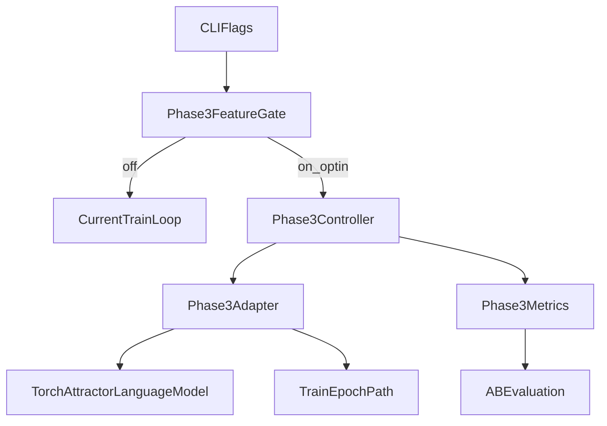

# Phase 3 Specification

Phase 3 is a guarded, opt-in extension for adaptive control around the existing attractor LM substrate.
The integration now exists in runtime behind explicit flags and remains off by default.

## Problem Statement

Phase 2/2.4 provides stable attractor dynamics, bounded TinyStories loading, and benchmark tooling. The next gap is controlled adaptation: how to evaluate and adjust behavior over time without destabilizing gradient flow, memory usage, or checkpoint compatibility.

## Objectives

- Keep core attractor math intact:
  - continuous state evolution
  - diffusion + cubic nonlinearity
  - distance-to-proto-attractor logits
- Introduce a clear, explicit control layer that can:
  - observe training/eval signals
  - suggest bounded adjustments
  - remain fully optional and off by default
- Preserve existing CLI/training/generation workflows unless feature flags are enabled.

## Non-Goals

- No hidden self-modifying loops in the default path.
- No direct mutation of autograd graphs across steps/epochs.
- No checkpoint schema breakage for existing `.pt` files.
- No invasive rewrite of `TorchAttractorLanguageModel`.

## Proposed Architecture

Phase 3 is isolated into a controller and adapter boundary.



### Module Boundaries

- `Phase3Controller` (new module)
  - reads metric snapshots
  - produces bounded control decisions
- `Phase3Adapter` (new module)
  - translates controller decisions into explicit, validated hooks
  - no direct autograd graph reuse
- Existing training loop
  - remains authoritative
  - only calls adapter when Phase 3 flag is enabled

## Interface Contracts (Draft)

```python
class Phase3MetricsSnapshot(TypedDict):
    epoch: int
    step: int
    train_loss: float
    val_loss: float | None
    steps_per_sec: float
    grad_norm: float | None
    timestamp_s: float

class Phase3Decision(TypedDict):
    action: Literal["noop", "adjust_lr", "adjust_clip", "enable_constraint"]
    params: dict[str, float | int | bool]
    reason: str
    ttl_steps: int
```

Rules:
- Decisions must be explicit, typed, and bounded by TTL.
- Unknown actions are rejected safely as `noop`.
- Adapter applies decisions only at step boundaries.

## Safety Gates

- `--phase3` (default off)
- `--phase3-budget-steps N` (hard cap on Phase 3 decision windows)
- `--phase3-budget-seconds N` (hard wall-clock cap)
- strict decision application (invalid decisions raise explicit errors; no silent fallback)

Runtime guards:
- Never call backward twice on the same graph path.
- Detach/clone any persistent snapshots used beyond a step.
- Disable Phase 3 automatically when NaN/Inf is detected.

## Evaluation Protocol

Use existing benchmark mode for A/B checks before any integration:

1. Baseline run with Phase 3 disabled.
2. Matched run with Phase 3 enabled and same seed.
3. Compare:
   - average loss over fixed step budget
   - steps/sec
   - repetition rate on fixed prompt set

Minimum acceptance for enabling wider tests:
- No regression in stability (no graph/memory runtime errors).
- Throughput regression < 10% unless loss quality gain is clear.

## Rollout Stages

1. **Spec + stubs**
   - this document + API skeletons only
2. **Offline simulation harness**
   - replay metric traces through controller decisions without training writes
3. **Opt-in prototype**
   - guarded CLI flag path, no default behavior change
4. **Guarded train integration**
   - bounded budget and fallback path; benchmarked against baseline

## Failure Modes and Mitigations

- **Repeated backward-through-graph**
  - Mitigation: strict step-boundary contracts; no retained graph tensors in controller state.
- **Unbounded memory growth**
  - Mitigation: bounded ring buffers for metrics; hard caps via step/time budgets.
- **Feedback instability**
  - Mitigation: action cooldown, TTL expiry, and conservative default no-op behavior.
- **Checkpoint incompatibility**
  - Mitigation: additive optional config fields only; `.get(...)` defaults during load.

## Current Status

Phase 3 is implemented as an opt-in subsystem under `attractor_llm/phase3` with:
- integrated training-time controller/adapter path behind `--phase3`
- detached self-improve advisor behind `--phase3-self-improve`
- generation-time deterministic constraints behind `--phase3-constraints`
- offline replay harness available in `--mode phase3-sim`

Default train/generate behavior remains unchanged when flags are not set.

