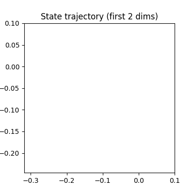

# `ts_attractor` package

Modular attractor substrate: **NumPy sandbox** (`numpy_demo.py`) and **PyTorch** wrappers (`dynamics.py`, `proto_attractors.py`, `training_loop.py`) aligned with `attractor_llm`.

## Limit-cycle storytelling

Training on cyclical token streams encourages **recurrent** state-space motion: the dynamics revisit neighborhoods instead of collapsing to a single fixed point for all time. See [`docs/attractor-substrate.md`](../docs/attractor-substrate.md).

## Basin blending

Multiple motif families compete through different token signals; the hidden state can sit **between** proto-attractor basins, producing blended next-token preferences.

## Intrinsic rhythm

Fixed-step Euler integration imposes a **computational clock**; optional hierarchical controllers (stub in `controller.py`) extend this to multiple timescales.

## Trajectory GIF (matplotlib)

Embedded preview (2D projection of a short orbit):

## Toy checkpoints

Pre-generated NumPy checkpoints live under [`checkpoints/toy/`](../checkpoints/toy/) (`toy_dim_64.npz`, `toy_dim_512.npz`, `toy_dim_4096.npz`). The 4096-D file uses a **cheap** deterministic vector (no full diffusion build) so laptops stay responsive.

## Notebook

See [`notebooks/demo.ipynb`](../notebooks/demo.ipynb) for an interactive demo (ipywidgets optional).
